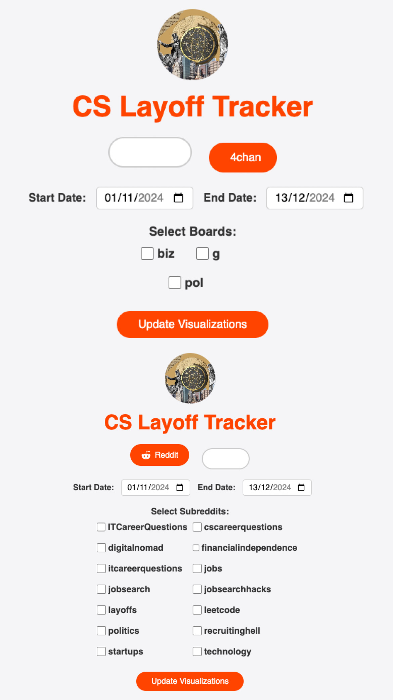
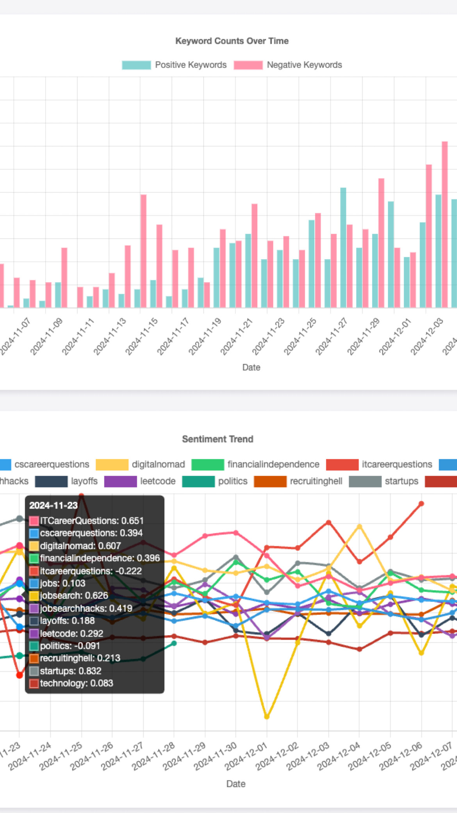

# **Automated Data Collection and Analysis Pipeline**

This repository contains an end-to-end automated pipeline for scraping, storing, and analyzing user-generated content from platforms like Reddit and 4chan. The pipeline includes data collection, toxicity detection, and sentiment analysis, enabling researchers to explore online discourse and gain actionable insights.
	


---


## **Features**
1. **Reddit Data Collection**:
   - Fetches new posts from specified subreddits using the Reddit API.
   - Performs toxicity analysis using the ModerateHateSpeech API.
   - Stores data in a MongoDB collection (`reddit_posts`).

2. **4chan Data Collection**:
   - Crawls thread catalogs and posts from specified boards using the 4chan API.
   - Analyzes post content for toxicity and stores data in MongoDB (`chan_posts`).

3. **Modular Architecture**:
   - Designed using Faktory workers for efficient and concurrent task execution.
   - Separate worker queues for subreddit and board crawling tasks.

4. **Data Storage**:
   - MongoDB database with separate collections for Reddit and 4chan data.
   - Indexed storage to avoid duplicate entries.

5. **Toxicity Detection**:
   - Integrates ModerateHateSpeech API to classify content as toxic or non-toxic.

6. **Custom Flask Dashboard**:
   - Visualizes sentiment trends, toxicity distribution, and engagement metrics.
   - Allows users to filter by date ranges, subreddits, and boards.

---

## **Folder Structure**
	```bash
	.
	├── static/                     # Static assets (CSS, JavaScript, images)
	├── templates/                  # HTML templates for the Flask web app
	├── app.py                      # Main Flask application
	├── chan_client.py              # Client to interact with 4chan API
	├── chan_crawler.py             # Crawler to fetch and process 4chan data
	├── cold_start_board.py         # Script to initialize 4chan crawling
	├── cold_start_subreddit.py     # Script to initialize subreddit crawling
	├── faktory_worker.py           # Faktory worker configuration
	├── reddit_client.py            # Client to interact with Reddit API
	├── reddit_crawler.py           # Crawler to fetch and process Reddit data
	├── reddit_past.py              # Experimental/legacy Reddit features
	├── requirements.txt            # Python dependencies
	├── utils.py                    # Utility functions for Flask API
	
	---

## **Setup Instructions**

### **1. Clone the Repository**

git clone https://github.com/yourusername/data-collection-pipeline.git
cd data-collection-pipeline

2. Install Dependencies

Ensure Python 3.8 or higher is installed. Install the required libraries:

pip install -r requirements.txt

3. Configure Environment Variables

Create a .env file in the root directory and add the following:

	REDDIT_CLIENT_ID=your_client_id
	REDDIT_CLIENT_SECRET=your_client_secret
	REDDIT_USERNAME=your_username
	REDDIT_PASSWORD=your_password
	MODERATEHATESPEECH_TOKEN=your_hatespeech_api_token
	MONGO_URI=mongodb://localhost:27017/

4. Start MongoDB

Ensure that MongoDB is running locally or configure the connection URI in the .env file.

mongod

5. Start Faktory

Install and start Faktory:

brew install faktory
faktory

Usage

1. Cold Start Data Collection

Reddit Subreddits

To initialize subreddit crawling, run:

python cold_start_subreddit.py <subreddit_name>

4chan Boards

To initialize 4chan board crawling, run:

python cold_start_board.py <board_name>

2. Run Faktory Workers

Start the Faktory workers for subreddit and board tasks:

python faktory_worker.py

3. Run the Flask Dashboard

Start the Flask web application:

python app.py

Navigate to http://127.0.0.1:5001 to access the dashboard.

MongoDB Collections

reddit_posts Collection

Field	Type	Description
subreddit	String	Name of the subreddit
post_id	String	Unique ID of the post
title	String	Post title
author	String	Author of the post
created_utc	DateTime	Post creation date (UTC)
content	String	Post content
comments	Integer	Number of comments
score	Integer	Upvotes/downvotes score
url	String	Link to the post
is_toxic	Boolean	Toxicity classification

chan_posts Collection

Field	Type	Description
board	String	Name of the 4chan board
thread_no	Integer	Thread number
post_no	Integer	Post number
created_at	DateTime	Post creation date (UTC)
name	String	Poster’s name (if available)
comment	String	Post content
replies	Integer	Number of replies
images	Integer	Number of images in the post
is_toxic	Boolean	Toxicity classification

Visualizations

The dashboard offers the following visualizations:
	1.	Sentiment Trend:
	•	Displays average sentiment over time for Reddit and 4chan data.
	2.	Toxicity Distribution:
	•	Compares toxic vs. non-toxic content for selected subreddits/boards.
	3.	Engagement Metrics:
	•	Shows average scores and user interactions.

Key Modules

1. Faktory Workers
	•	Concurrent task execution using Faktory.
	•	Queues:
	•	crawl-subreddit: Handles subreddit crawling.
	•	crawl-catalog & crawl-thread: Handle 4chan catalog and thread crawling.

2. Toxicity Detection
	•	Integrates ModerateHateSpeech API to classify text toxicity.
	•	Confidence threshold: 0.9.

3. MongoDB Storage
	•	Efficient storage and indexing for large datasets.
	•	Prevents duplicate entries using unique indexes.

4. Flask Dashboard
	•	Interactive web application for data exploration and visualization.

Developer Notes

1. Extendable Architecture
	•	Add more worker queues to process additional data sources.
	•	Use schedule_crawl_* functions to set up periodic crawling.

2. Debugging
	•	Enable debug mode for Flask:

app.run(debug=True, port=5001)


•	Monitor logs in the console.

3. API Rate Limits
	•	Reddit API has rate limits. Ensure adequate delays between requests to avoid bans.

Future Enhancements
	1.	Sentiment Analysis Integration:
	•	Add NLP pipelines to compute sentiment scores for each post.
	2.	Scalability:
	•	Deploy on cloud platforms like AWS or GCP for large-scale crawling.
	3.	Enhanced Visualizations:
	•	Include more detailed metrics like time-series heatmaps and network graphs.

Contributing
	1.	Fork the repository.
	2.	Create a feature branch:

git checkout -b feature-name


3.	Commit your changes:

git commit -m "Add new feature"


4.	Push to the branch:

git push origin feature-name


5.	Create a pull request.

Acknowledgments
	•	Reddit API Documentation
	•	4chan API Documentation
	•	ModerateHateSpeech API

